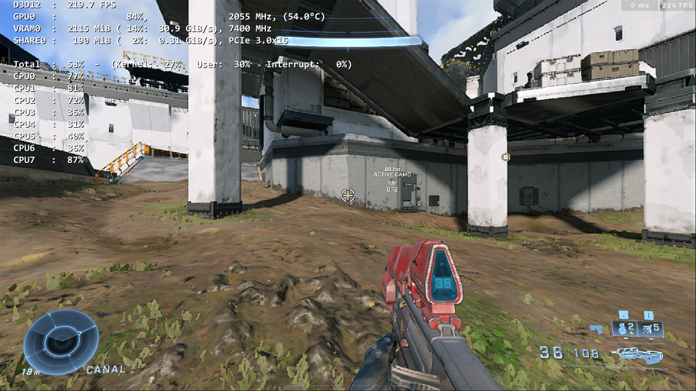
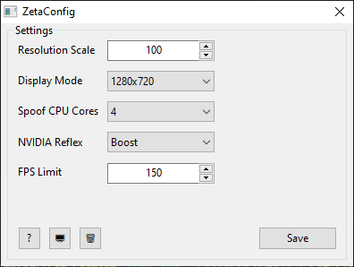

# ZetaConfig 
A tool to optimize and fix performance issues with Halo Infinite.       
**Note: ZetaConfig only supports the Steam release of Halo Infinite!**

# Discussions
I plan to use GitHub Discussions to provide various technical information on Halo Infinite & ZetaConfig!

Check out **[ZetaConfig Discussions](https://github.com/Aetopia/ZetaConfig/discussions)**.

## What's ZetaConfig?
ZetaConfig aims to fix the glaring issues with the Halo Infinite PC experience.               
This tool doesn't touch upon every single issue but focuses on the following:

1. High CPU Usage.
2. Window Scaling.
3. Ability to play at low display resolutions/modes.
2. Performance.
3. NVIDIA Reflex Support.

These are some of the core issues, you might have encountered while playing Halo Infinite on PC.

But technically ZetaConfig is just a frontend for configuring specific settings within these 2 open source projects:
1. [Special K](https://wiki.special-k.info) | [GitHub](https://github.com/SpecialKO/SpecialK)

   > An extensive game modifying framework allowing for various forms of in-depth tweaking of a game. The focus is primarily on the graphics pipeline but the tool also includes features such as input device blocking/configuring, window and volume management, enhancements for some of the in-game functionality of Steam, and more.

2. [Borderless Window Extended](https://github.com/Aetopia/ZetaConfig/tree/main/src/Borderless%20Window%20Extended/README.md)
    > A tool to extend the feature set of borderless windowed mode in programs.
    1. Use a specific display mode/display resolution of your choice with a specific windowed program for better performance.
    2. Override a program 's borderless window implementation with a statically sized borderless window.
    3. Automatically minimize a borderless window when its not the foreground window for better multitasking.

ZetaConfig utilizes the following features from the specified projects:

### From Special K:
1. Spoof CPU Core Count:     
    This option is used to fool the game into thinking that the CPU core count is lower than usual.

    ### Examples

    #### All Cores (i7-10700K with Hyper-Threading disabled.)
    > Note: 
    Halo Infinite's December 2022 update fixes the fixes the following:                 
    "The simulation rate now matches the framerate, meaning uncapped and higher framerates on PC will no longer result in unnecessary CPU usage."        
    TLDR; CPU usage should be marginally lower than before but this will depend on your CPU.

    > **Image 1**:              
    > 

    #### Spoofed 4 Cores (i7-10700K with Hyper-Threading disabled.)
    > **Image 2**:                     
    > 

    Spoofing the CPU core count seems to determine how many threads should be used for compute.      

    In `[Image 1]`, the game is using all threads but in `[Image 2]`, CPUs `3, 4, 5, 6` are being either being less prioritized to be used by the game or just being given less relevance thus leading to lower CPU usage.

    Technically Halo Infinite uses 9 compute threads, explaining why the i7-10700K was having 100% with Hyper Threading disabled.

    If your CPU has more than 9 compute threads those will simply be underutlized by the game or will given less relevance.                              

    There can decrease peek framerate if the CPU Core count is set to a low value so it is recommended to use this option in conjunction with a framerate limit. 
   
2. NVIDIA Reflex:                      
    Special K can allow compatible DX11/12 games to utlize NVIDIA Reflex.

3. Framelimiter:                               
    Special K offers a superior framelimiter as compared to the ingame framelimiter.      
    The Special K framelimiter is used since the ingame Min/Max FPS are set to 960 allow for aggressive dynamic resolution scaling for better performance.

### From Borderless Window Extended
1. Ability to use a specific resolution upon a specific application when being it is utilized.  
2. Can run a windowed program as a borderless window at a desired display resolution.  

# Does ZetaConfig alter any Halo Infinite settings?

ZetaConfig alters a few ingame options:

1. Minimum Framerate & Maximum Framerate are set to `960`.           
    Aggressive Dynamic Resolution Scaling is beneficial for improving performance.  

2. Ingame Sharpness is set to Max when Minimum Framerate set to `960` the option is set to max to compensate for this for any quality/sharpness lost due to aggressive dynamic resolution scaling.

3. Borderless Fullscreen is disabled. This is intentionally done offload borderless window functionality to Window Display Mode Tool.

>You see the Pros and Cons of the Minimium Framerate setting can be seen here:     
> https://github.com/Aetopia/Minimum-Framerate-Halo-Infinite

# Options
        
ZetaConfig offers the user with a multitude of options to configure, each of them are explained here.

1. `Resolution Scale`:       
    Set the ingame render resolution. You can set any value between `50 ~ 100`.

2. `Display Mode` (Provided by Window Display Mode Tool.):        
    Configure the display resolution and window size, the game will run at.

3. `Spoof CPU Cores` (Provided by Special K.):                  
    This option allows one to make their CPU core count to appear lower than actual.
    Lower values can reduce CPU usage by a significant amount.   

4. `NVIDIA Reflex` (Provided by Special K.):                       
    Configure NVIDIA Reflex with this option.

    1. Off: NVIDIA Reflex is disabled.
    2. On: Only Low Latency is enabled.
    3. Boost: Only Boost is enabled.
    4. On + Boost: Low Latency + Boost is enabled.
   
5. `FPS Limit` (Provided by Special K.):                          
    Set a framelimit for the game.                              
    (Due ZetaConfig setting the ingame minimum and maximum framerate to 960, we cannot use the ingame framelimiter.)

6. `[🖥️]` Button:                        
        Pressing this button will make ZetaConfig redetect on which monitor, Halo Infinite is set to launch on.

Click on the `[Save]` button to apply your settings.

## Accessing Special K Settings
You can access the Special K Control Panel, by pressing Ctrl + Shift + Backspace ingame.               
Check out the wiki for the all of the features of Special K: https://wiki.special-k.info

# Installation
1. Fetch the latest release from [GitHub Releases](https://github.com/Aetopia/ZetaConfig/releases).
2. Run `ZetaConfig.exe`.
3. Let ZetaConfig finish its initialization process.
4. Once the ZetaConfig UI pops up, you are good to go!
5. Configure your settings and then hit `[Save]` to save your settings.
6. Launch your game!

# Uninstallation
Click on the `[🗑️]` button to uninstall Special K and Borderless Window Extended.

# Building
**Building Instructions:** https://github.com/Aetopia/ZetaConfig/blob/main/src/README.md

# FAQ
1. Why is Halo Infinite's launch after installing Special K + Window Display Mode Tool slow?   

    The game is compiling shaders since Special K is loaded into the game.
    Once they compile, launches should be snappy and fast.

2. How to do I fix texture quality loss when using a lower display mode/render resolution?
    
    If you are on an NVIDIA card, you are in luck!
    1. Download [NVIDIA Profile Inspector](https://github.com/Orbmu2k/nvidiaProfileInspector/releases).    
    
    2. Open it and search for the Halo Infinite profile.

    3. Find the following options:     
        - `Antialiasing - Transparency Supersampling`         
            Set its value to: `0x00000008 AA_MODE_REPLAY_MODE_ALL`

        - `Texture filtering - LOD Bias (DX)`         
            Set to a negative value of your choice. (**Recommended: `-1.00 ~ -2.00`**)                               