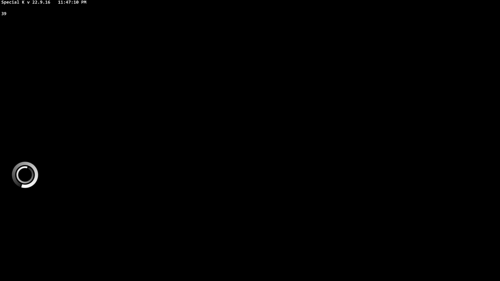
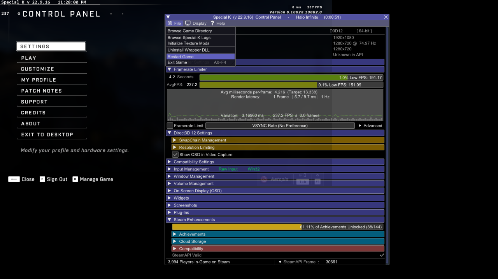
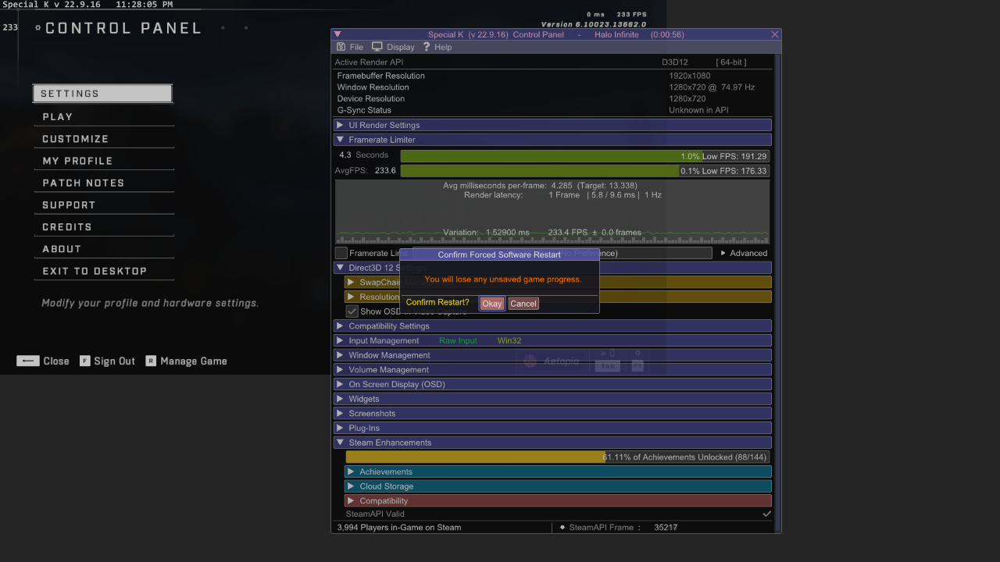

# ZetaConfig 
A simple tool to optimize and fix performance issues with Halo Infinite.
**Note: ZetaConfig only supports the Steam release of Halo Infinite!**

# Discussions
I plan to use GitHub Discussions to provide various technical information on Halo Infinite & ZetaConfig!

Check out **[ZetaConfig Discussions](https://github.com/Aetopia/ZetaConfig/discussions)**.

## What's ZetaConfig?
ZetaConfig aims to fix the glaring issues with the Halo Infinite PC experience.               
ZetaConfig doesn't touch upon every single issue but focuses on the following:

1. High CPU Usage.
2. Window Scaling.
3. Ability to play at low display resolutions/modes.
2. Performance.
3. NVIDIA Reflex Support.

These are some of the core issues, you might have encountered while playing Halo Infinite on PC.

But technically ZetaConfig is just a frontend for configuring specific settings within these 2 open source projects:
1. [Special K](https://wiki.special-k.info) | [GitHub](https://github.com/SpecialKO/SpecialK)

   > An extensive game modifying framework allowing for various forms of in-depth tweaking of a game. The focus is primarily on the graphics pipeline but the tool also includes features such as input device blocking/configuring, window and volume management, enhancements for some of the in-game functionality of Steam, and more.

2. [Resolution Enforcer](https://github.com/Aetopia/ResEnforce)
    > A program that fundamentally allows you to force an application to run at a specific resolution of your choice.              
    Example: Switch to `1280x720` whenever you use `cmd.exe` and swap back to your screen native resolution when its closed or minimized.

ZetaConfig utilizes the following features from the specified projects:

### From Special K:
1. Window Management: 
    This is used to fix scaling issues with the game being used with low display resolutions like `1280x720`, `1366x768`.

2. Spoof CPU Core Count:     
    This option is used to fool the game into thinking that the CPU core count is lower than usual.

    ### Examples

    #### All Cores (i7-10700K with Hyper-Threading disabled.)
    > **Image 1**:              
    > 

    #### Spoofed 4 Cores (i7-10700K with Hyper-Threading disabled.)
    > **Image 2**:                     
    > 

    Spoofing the CPU core count seems to determine how many threads should be used for compute.      

    In `[Image 1]`, the game is using all threads but in `[Image 2]`, CPUs `3, 4, 5, 6` are being either being less priortized to be used by the game or just being given less relevance thus leading to lower CPU usage.

    Technically Halo Infinite uses 9 compute threads, explaining why the i7-10700K was having 100% with Hyper Threading disabled.

    If your CPU has more than 9 compute threads those will simply be underutlized by the game or will given less relevance.
    
    Using this option can decrease peak framerate so its recommended to be used in conjunction with limiting your framerate.  
   
3. NVIDIA Reflex:                      
    Special K can allow compatible DX11/12 games to utlize NVIDIA Reflex.

4. Framelimiter:                               
    Special K offers a superior framelimiter as compared to the ingame framelimiter.      
    The Special K framelimiter is used since the ingame Min/Max FPS are set to 960 allow for aggressive dynamic resolution scaling for better performance.

### From Resolution Enforcer
1. Ability to enforce a specific resolution upon a specific application when being it is utilized.     
2. UWP & Win32 app support.     

# Does ZetaConfig alter any Halo Infinite settings?

ZetaConfig alters a few ingame options:

1. Minimum Framerate & Maximum Framerate are set to `960`.           
    Aggressive Dynamic Resolution Scaling is beneficial for improving performance.  

2. Ingame Sharpeness is set to Max when Minimum Framerate set to `960` the option is set to max to compensate for this for any quality/sharpness lost due to aggressive dynamic resolution scaling.

3. Borderless Fullscreen is disabled. This is intentionally done to allow Special K to handle window scaling when in borderless fullscreen mode.

>You see the Pros and Cons of the Minimium Framerate setting can be seen here:     
> https://github.com/Aetopia/Minimum-Framerate-Halo-Infinite


# Options
        
ZetaConfig offers the user with a multitude of options to configure, each of them are explained here.

1. `Resolution Scale`:       
    Set the ingame render resolution. You can set any value between `50 ~ 100`.

2. `Display Mode` (Provided by Resolution Enforcer.):        
    Configure the display resolution, the game will run at.

3. `Spoof CPU Cores` (Provided by Special K.):                  
    This option allows one to make their CPU core count to appear lower than actual.
    Lower values can reduce CPU usage by a significant amount.   

4. `NVIDIA Reflex` (Provided by Special K.):                       
    Configure NVIDIA Reflex with this option.

    1. Off: NVIDIA Reflex is disabled.
    2. On: Only Low Latency is enabled.
    3. Boost: Only Boost is enabled.
    4. On + Boost: Low Latency + Boost is enabled.
   
5. `FPS Limit` (Provided by Special K.):                          
    Set a framelimit for the game.                              
    (Due ZetaConfig setting the ingame minimum and maximum framerate to 960, we cannot use the ingame framelimiter.)

Click on the `[Save]` button to apply your settings.

## Accessing Special K & Resolution Enforcer Settings
You can access the Special K Control Panel, by pressing Ctrl + Shift + Backspace ingame.               
Check out the wiki for the all of the features of Special K: https://wiki.special-k.info

Resolution Enforcer's configuration file can be accessed here: 
```
"%USERPROFILE%\My Mods\ResEnforce\Options.ini"
```

# Installation
1. Fetch the latest release from [GitHub Releases](https://github.com/Aetopia/ZetaConfig/releases).
2. Run `ZetaConfig.exe`.
3. You will be prompted to install the Special K & Resolution Enforcer in order for ZetaConfig to work.
4. ZetaConfig will prompt you to add the Resolution Enforcer task to Task Scheduler.
    This will allow for Resolution Enforcer to run when you startup Windows.
    Adminstrator privileges are required for this step.
5. Once the ZetaConfig UI pops up, you are good to go!
6. Configure your settings and then hit `[Save]` to save your settings.
7. Then launch Halo Infinite, if the game launches like this and swaps to a lower display resolution automatically that means everything is working fine!
    > I have removed the `intro.mp4` and `Startup_Sequence_Loading.mp4` from my Halo Infinite installation and enabled the Special K OSD.                           
    For you, Intro video will play in the corner without the Special K OSD.

    

# Uninstallation
1. Navigate to Halo Infinite's installation directory on your system.      
    Example:       
    ```
    C:\Program Files (x86)\Steam\steamapps\common\Halo Infinite
    ```
2. Delete `dxgi.dll` and `dxgi.ini`. (This removes Special K.)  

3. Run the following command in Command Prompt or PowerShell:    
    ```
    taskkill /f /im ResEnforce.exe     
    ```

3. Go to your documents folder and delete the `My Mods` folder. (This removes Resolution Enforcer.)

# Building
1. Install Nim: https://github.com/dom96/choosenim
    > Run the tool 2~3 times to ensure Nim installs properly.
    > If Nim isn't in your `SYSTEM` path, then reboot.

2. Install the following dependencies:
    ```
    nimble install winim wNim
    ```

3. Run the following command to compile:
    ```ps
    nim c -d:release --opt:size -o:ZetaConfig.exe src/main.nim
    ```
    > Optional: Compress using UPX.         
        ```
        upx -9 ZetaConfig.exe
        ```

4. Run `ZetaConfig.exe`.

# FAQ
1. Why is Halo Infinite's launch after installing Special K + Resolution Enforcer slow?   

    The game is compiling shaders since Special K is loaded into the game.
    Once they compile, launches should be snappy and fast.

2. How to do I fix texture quality loss when using a lower display mode/render resolution?
    
    If you are on an NVIDIA card, you are in luck!
    1. Download [NVIDIA Profile Inspector](https://github.com/Orbmu2k/nvidiaProfileInspector/releases).    
    
    2. Open it and search for the Halo Infinite profile.

    3. Find the following options:     
        1. `Antialiasing - Transparency Supersampling`         
            Set its value to: `0x00000008 AA_MODE_REPLAY_MODE_ALL`
    
        2. `Texture filtering - LOD Bias (DX)`         
            Set to a negative value of your choice. (**Recommended: `-1.00 ~ -2.00`**)

3. Halo Infinite is rendering the corner of the screen surrounded by black bars.

    **Note: This isn't an issue with your Graphics Control Panel Scaling Mode!**
    

    **If Halo Infinite launches like this then do the following:**
    1. Press Ctrl + Shift + Backspace to open the Special K Control Panel.
    2. Click on File and then Restart.
        
    3. Click on the `[Okay]` button.
         
    ### OR
    **Just press `[Alt]` + `[F4]` & relaunch the game**

    ### Why does this happen?
    You might have likely taken focus away from the game window when it was launching.
    Resulting in Halo Infinite to set the framebuffer area to your screen native resolution but rendering in the corner of the window.

    You can mitigate this by allowing the game to first properly launch then swap to your desired display mode/resolution.