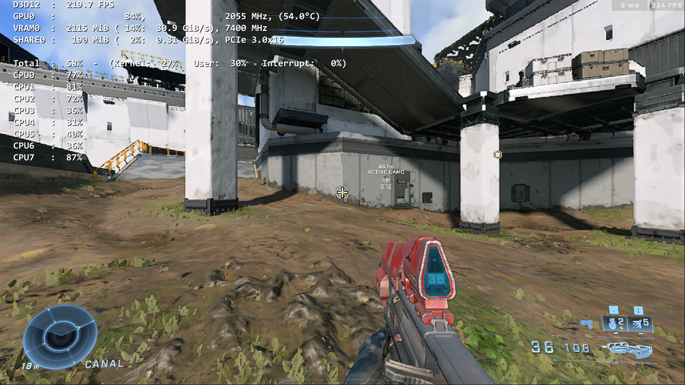
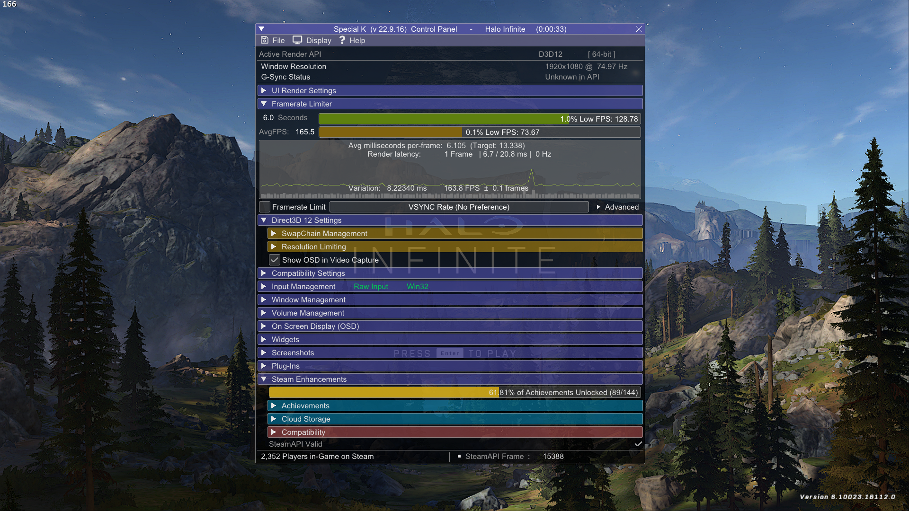
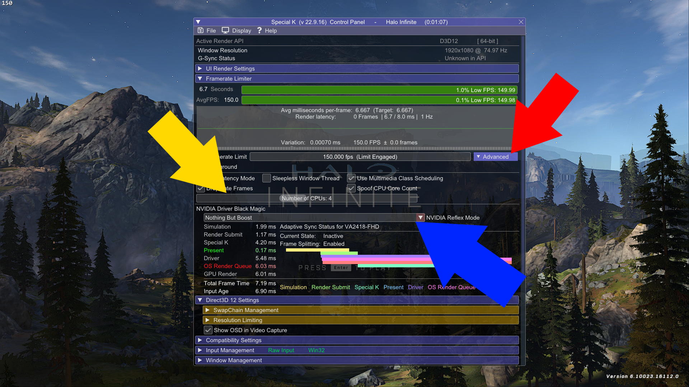
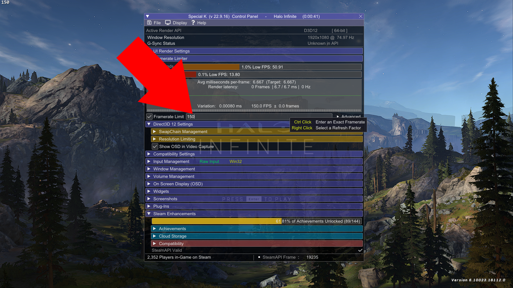

# ZetaMod 
A tool to optimize and fix performance issues with Halo Infinite.       
**Note: ZetaMod only supports the Steam release of Halo Infinite!**

## What's ZetaMod?
ZetaMod aims to fix the glaring technical issues with the Halo Infinite PC experience.               
This tool doesn't touch upon every single issue but focuses on the following:

1. High CPU Usage.
2. Window Scaling.
3. Performance.
3. NVIDIA Reflex Support.

These are some of the core issues, you might have encountered while playing Halo Infinite on PC.

ZetaMod utilizes the following features from the specified projects:        

1. [Special K](https://wiki.special-k.info) | [GitHub](https://github.com/SpecialKO/SpecialK)

   > An extensive game modifying framework allowing for various forms of in-depth tweaking of a game. The focus is primarily on the graphics pipeline but the tool also includes features such as input device blocking/configuring, window and volume management, enhancements for some of the in-game functionality of Steam, and more.

2. [Zeta](https://github.com/Aetopia/ZetaMod/tree/main/src/Zeta/README.md)
    > A library that adds missing features into Halo Infinite.

### From Special K:
1. Spoof CPU Core Count:     
    This option is used to fool the game into thinking that the CPU core count is lower than usual.

    > **Halo Infinite's December 2022 update fixes the fixes the following:**                   
    **"The simulation rate now matches the framerate, meaning uncapped and higher framerates on PC will no longer result in unnecessary CPU usage."**               
    **TLDR; CPU usage should be marginally lower than before but this will depend on your CPU.**               

    ### Examples

    #### All Cores (i7-10700K with Hyper-Threading disabled.)

    > **Image 1**:              
    > 

    #### Spoofed 4 Cores (i7-10700K with Hyper-Threading disabled.)
    > **Image 2**:                     
    > 

    Spoofing the CPU core count seems to determine how many threads should be used for compute.      

    In `[Image 1]`, the game is using all threads but in `[Image 2]`, CPUs `3, 4, 5, 6` are being either being less prioritized to be used by the game or just being given less relevance thus leading to lower CPU usage.

    Technically Halo Infinite uses 9 compute threads, explaining why the i7-10700K was having 100% with Hyper Threading disabled.

    If your CPU has more than 9 compute threads those will simply be underutlized by the game or will given less relevance.                              

    There can decrease peek framerate if the CPU Core count is set to a low value so it is recommended to use this option in conjunction with a framerate limit. 
   
2. NVIDIA Reflex:                      
    Special K can allow compatible DX11/12 games to utlize NVIDIA Reflex.

3. Framelimiter:                               
    Special K offers a superior framelimiter as compared to the ingame framelimiter.      
    The Special K framelimiter is used since the ingame Min/Max FPS are set to 960 allow for aggressive dynamic resolution scaling for better performance.

### From Zeta
1. Use a specific display mode/display resolution of your choice with a specific windowed program for better performance.
2. Override a program's borderless window implementation with a statically sized borderless window.
3. Automatically minimize a borderless window when its not the foreground window for better multitasking.

# Does ZetaMod alter any Halo Infinite settings?

ZetaMod alters a few ingame options:

1. Minimum Framerate & Maximum Framerate are set to `960`.           
    Aggressive Dynamic Resolution Scaling is beneficial for improving performance.  

2. Ingame Sharpness is set to Max when Minimum Framerate set to `960` the option is set to max to compensate for this for any quality/sharpness lost due to aggressive dynamic resolution scaling.

3. Borderless Fullscreen is disabled. This is intentionally done offload borderless window functionality and allow for the use of user defined display modes/resolutions to Zeta.

> You see the Pros and Cons of the Minimium Framerate setting can be seen here:     
https://github.com/Aetopia/Minimum-Framerate-Halo-Infinite


# Configure Special K and Zeta.
           
To configure Special K, press `[Ctrl] + [Shift] + [Backspace]` to open the Special K Control Panel.



1. `Custom Display Resolution` (Provided by Zeta.):        
    To to use a specific display mode/resolution, simply change the window size option within Halo Infinite video's settings & restart the game.         
    Video: [How to configure display mode/resolution?](res/ResWndSize.mp4)

2. `Spoof CPU Cores` & `NVIDIA Driver Black Magic` (Provided by Special K.):   
    Expand the Framerate Limiter tab and then click `Advanced` (Red).               
    - `Spoof CPU Cores` (Yellow) Default: 4                
        This option allows one to make their CPU core count to appear lower than actual.
        Lower values can reduce CPU usage by a significant amount.       
        Drag the slider to increase or decrease the Core count.    

    - `NVIDIA Driver Black Magic` (Blue) Default: Nothing But Boost          
        Configure NVIDIA Reflex with this option.
    
    
  
3. `FPS Limit` (Provided by Special K.): 
    Expand the Framerate Limiter tab.                         
    Enable the Framerate Limiter, `[Ctrl] + Click` on the textbox & enter your desired framerate limit.         

    **Note: Due ZetaMod setting the ingame minimum and maximum framerate to 960, we cannot use the ingame framelimiter.**

    


## Exploring Special K.     
Check out the wiki for the all of the features of Special K: https://wiki.special-k.info

# Installation
1. Fetch the latest release from [GitHub Releases](https://github.com/Aetopia/ZetaMod/releases).
2. Run `ZetaMod.exe`.
3. Let ZetaMod finish its initialization and optimization process.
4. Launch your game!
# Uninstallation
1. Browse Halo Infinite local files.
2. Delete the following files:
    ```
    dxgi.dll dxgi.ini Zeta.dll
    ```
3. Special K & Zeta are now uninstalled.

# Building
**Building Instructions:** https://github.com/Aetopia/ZetaMod/blob/main/src/README.md

# FAQ
1. Why is Halo Infinite's launch after installing Special K + Zeta slow?   

    The game is compiling shaders since Special K is loaded into the game.
    Once they compile, launches should be snappy and fast.

2. How to do I fix texture quality loss when using a lower display mode/render resolution?
    
    If you are on an NVIDIA card, you are in luck!
    1. Download [NVIDIA Profile Inspector](https://github.com/Orbmu2k/nvidiaProfileInspector/releases).    
    
    2. Open it and search for the Halo Infinite profile.

    3. Find the following options:     
        - `Antialiasing - Transparency Supersampling`         
            Set its value to: `0x00000008 AA_MODE_REPLAY_MODE_ALL`

        - `Texture filtering - LOD Bias (DX)`         
            Set to a negative value of your choice. (**Recommended: `-1.00 ~ -2.00`**)                               